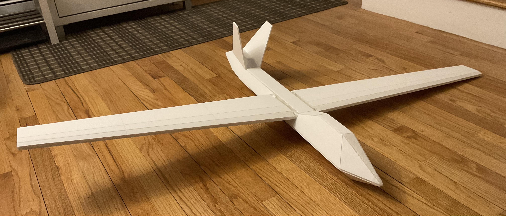

# Foam Airplane Models

Here are the foam model planes that I've built. I design the models in Blender, UV unwarp them, then print the UVs out and trace them on to Dollar Tree Readi-Boards (They are the best). By following the UV folds, I can slowly peice each section of the plane together into one final complete model.

## F-22 Raptor

This is really the beginning of my journey with aviation and aerospace. One of my friend suggested we build a model F-35 Lightning II fighter jet. He chose it since it was the newest. This sent me in a research rabbit hole of fighter jets and I soon discovered the amazing capabilities of the F-22 Raptor and decided I have to try and build a model myself.

---

The first few models were tiny and made out of just a single sheet of printer paper. As my assembling skills slowly got better, the size of the models slowly grew. At first 1 peice, then 2, then 4, and suddenly, they were taking up to 20 peices of paper, 4 of which was just for one wing!

|  |  |  |  |
|-|-|-|-|
|  |  |  |  |

Prototype after prototype, the models slowly improved. Seams got smoother, joints got more sturdy, adjustment panels were added... In the end, I had a whole fleet if foam Raptors. It was especially rewarding putting them all together, being able to physically see all your hardwork and progress.

|  |  |  |  |
|-|-|-|-|

Although my friend eventually got bored and decided to end this project, I learned so much from it and had so much fun. I wouldn't know where I would be today if I hadn't been inspired by this project to step into the amazing world of DIY and amateur engineering. To this day I am still very grateful.

---

### F22 in action

In case you were wondering... it does fly! Here are a few clips of me throwing the models and seeing how the glide.

|||||
|-|-|-|-|

## AirFish 8 (AF8)

One day I stumbled upon a [YouTube video by Interesting Engineering](https://youtu.be/-r7mFSq8PRU?si=FJWMoupE4mdjWeQk) about a plane that only flew close to the surface of the water and was supposedly a lot more efficient than conventional aviation. It turns out this was the Widgetworks AirFish 8 and it utilizes an aerodynamic phenomenon known as the "ground effect", which increases lift drasitcally when a plane is close to the ground. Since I didn't know RC or any electronics at this point, my models wouldn't be powered and would only stay near the ground. It was the perfect opportunity to try building one and testing it out myself.

|| | |  |
|-|-|-|-| 

### AF8 in action

Taking all the lessons learned from the F-22 project, this model was much more succesful from the start and to my surprise, it really did work. By throwing it from near the ground, it stayed and turned gently in the air for much longer than any of my Raptor models would. By pushing it starting on ground, it would lift itself almost immediately, hovering just slightly above ground, gliding over much longer distances than it otherwise would have it any part of it did drag against the floor.

||||
|-|-|-|

I can pretty confidently say that this was the project that really got me interested in aerodynamics and all the odd querks that comes with objects interacting with a fluid.

||||
|-|-|-|

## Glider

| | | |
|-|-|-|

Glider in action

|||
|-|-|
