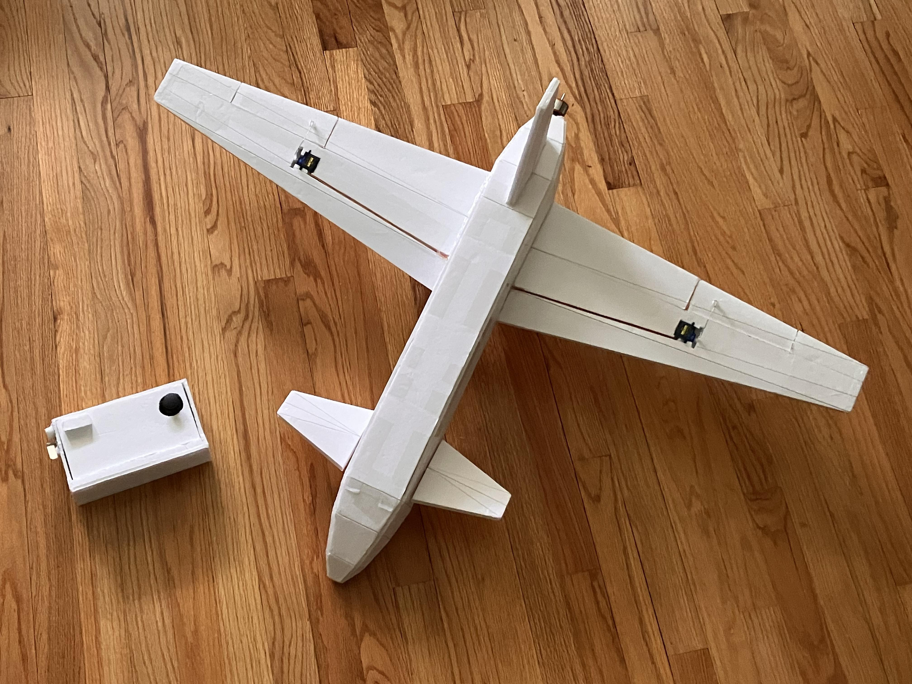

# Foam Airplane Models

Here are the foam model planes that I've built. I design the models in Blender, UV unwarp them, then print the UVs out and trace them on to Dollar Tree Readi-Boards (They are the best). By following the UV folds, I can slowly peice each section of the plane together into one final complete model.

## F-22 Raptor

This is really the beginning of my journey with aviation and aerospace. One of my friend suggested we build a model F-35 Lightning II fighter jet. He chose it since it was the newest. This sent me in a research rabbit hole of fighter jets and I soon discovered the amazing capabilities of the F-22 Raptor and decided I have to try and build a model myself.

---

The first few models were tiny and made out of just a single sheet of printer paper. As my assembling skills slowly got better, the size of the models slowly grew. At first 1 peice, then 2, then 4, and suddenly, they were taking up to 20 peices of paper, 4 of which was just for one wing!

|  |  |  |  |
|-|-|-|-|
|  |  |  |  |

Prototype after prototype, the models slowly improved. Seams got smoother, joints got more sturdy, adjustment panels were added... In the end, I had a whole fleet if foam Raptors. It was especially rewarding putting them all together, being able to physically see all your hardwork and progress.

|  |  |  |  |
|-|-|-|-|

Although my friend eventually got bored and decided to end this project, I learned so much from it and had so much fun. I wouldn't know where I would be today if I hadn't been inspired by this project to step into the amazing world of DIY and amateur engineering. To this day I am still very grateful.

---

### F-22 video demos

In case you were wondering... it does fly! Here are a few clips of me throwing the models and seeing how the glide.

|||||
|-|-|-|-|

## AirFish 8 (AF8)

One day I stumbled upon a [YouTube video by Interesting Engineering](https://youtu.be/-r7mFSq8PRU?si=FJWMoupE4mdjWeQk) about a plane that only flew close to the surface of the water and was supposedly a lot more efficient than conventional aviation. It turns out this was the Widgetworks AirFish 8 and it utilizes an aerodynamic phenomenon known as the "ground effect", which increases lift drasitcally when a plane is close to the ground. Since I didn't know RC or any electronics at this point, my models wouldn't be powered and would only stay near the ground. It was the perfect opportunity to try building one and testing it out myself.

|| | |  |
|-|-|-|-| 

### AF8 video demos

Taking all the lessons learned from the F-22 project, this model was much more succesful from the start and to my surprise, it really did work. When throwing it normally, it would only aggressively pitch up and stall, but by throwing it from near the ground, it stayed and turned gently in the air. By pushing it starting on ground, it would lift itself almost immediately, hovering just slightly above ground, gliding over much longer distances than it otherwise would have it any part of it did drag against the floor.

||||
|-|-|-|

I can pretty confidently say that this was the project that really got me interested in aerodynamics and all the odd querks that comes with objects interacting with a fluid.

||||
|-|-|-|

## MQ-9 Reaper

After watching a [YouTube video by Think Flight](https://youtu.be/OUTamxgsikY?si=oi1IDEiv-qgMAtGQ) about planes with high aspect ratio with high efficiency at low speeds, I decided to try making one myself and see if I can make a plane that can glide further than any of my previous planes. When it comes to high aspect ratio planes, the first one that comes to my mind was the MQ-9 Reaper, so I decided to model my foam version after it.

|  |  |  |
|-|-|-|

The much shorter chord length meant that it was much more sensitive to where the center of mass was and much less resistant to angle of attack changes. This made hand launching them quite a bit more difficult, althought when the center of mass was properly aligned and it was thrown at just the right angle, it glided a lot further than any of my previous models have.

### MQ-9 video demos

|||
|-|-|

## Powered Model

After finally learning some basic electronics and Arduino, I decided to try and make my own remote controlled aircraft using HC-12 radio transceiver modules to send commands between an onboard Arduino NANO and a ground controller Arduino UNO. 

|||
|-|-|

I decided to give this model canards since they seemed simple and would also provide good pitching authority. For roll control I added ailerons on both sides of the rear mounted wing. The engine was an A2212 2200kv brushless motor mounted at the end of the fuselage. 

|||||
|-|-|-|-|

After programming the communication between the Arduino UNO transmitter and the onboard Arduino NANO receiver and implementing numerous safety features including local errorenous signal filtering, emergency power-off buttons, and temperature sensors on the electric speed controller, the communciation between the two HC-12 radio modules was just not reliable enough. 

I have since purchased a Flysky FS-i6 RC Transmitter and I hope to one day revive this project and finally make a flyable model plane myself.

||||
|-|-|-|